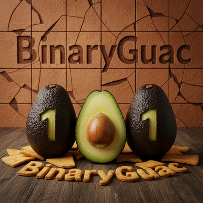

# BinaryGuac4All

** By Frederic Rocha **

Welcome to my Github :smile:

Some projects have been worked on in the past years, but only putting them here for sharing.
Please comment and participate if you wish.

The nick name of the repo is BinaryGuac for Binary Guacamole.
I wanted to use binary soup, but looks like someone already took it.
Anyway, it's easier to read than the Matrix!

- [x] :heavy_check_mark:
- [ ] :fr:
- [ ] Have fun :tada:

